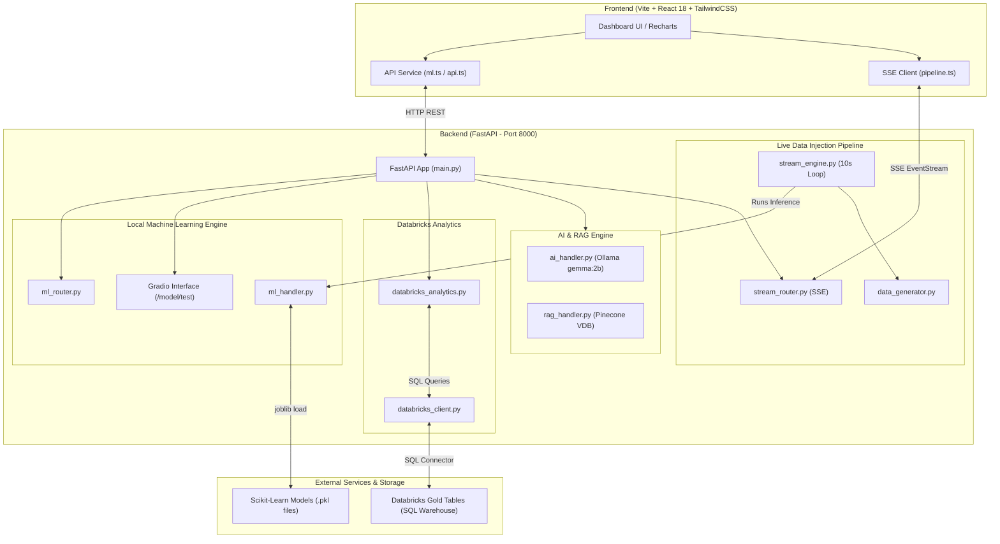

# RIMS — Autonomous Supply Chain & Inventory Management System using Databricks & RAG

**RIMS** (Autonomous Supply Chain & Inventory Management System using Databricks & RAG) is an enterprise-grade, Databricks-backed supply chain analytics and machine learning platform. It combines live Databricks Gold-layer analytics, real-time multi-model machine learning inference (delivery risk classification, isolation forest anomaly detection, and autoregressive demand forecasting), an automated 10-second live data injection streaming pipeline via Server-Sent Events (SSE), an interactive Gradio model testing interface, and an AI-powered RAG (Retrieval-Augmented Generation) assistant.

---

## Current Operations

RIMS keeps its historical analytics and real-time signals deliberately separate, then presents them together in the dashboard:

- **Historical Gold analytics**: The dashboard reads the consolidated Databricks table configured by `DATABRICKS_HISTORICAL_TABLE` (currently `main.default.gold_all_features_clean`). These values are cached according to `DATABRICKS_CACHE_TTL_SECONDS` and remain static between Gold-table refreshes.
- **Live pipeline**: An independent in-memory SSE pipeline generates a fresh order/risk prediction and demand prediction every 10 seconds. The Gold table is never written to or modified by this pipeline.
- **Logistics Mix selector**: Historical Gold months are static. **July 2026** is intentionally static sample data. **August 2026** is the live view and refreshes from the current rolling stream buffer only while selected.
- **Demand Forecast**: Historical Gold demand is shown with the existing live ML forecast overlay.
- **Shipments**: Headline totals and the shipment table combine historical Gold records with the current live buffer. The volume chart always covers the most recent Monday–Sunday window, adding live classifications to today.

## RIMS Chatbot (RIMS Copilot)

The **AI Assistant** page (`/ai-assistant`) provides a supply-chain copilot for questions about forecasts, inventory, shipment risk, and uploaded operational knowledge.

- It retrieves relevant internal document chunks from **Pinecone** and generates the answer locally through **Ollama** (default model: `gemma:2b`).
- Answers are grounded only in retrieved records and cite them as `[Record N]`. When the knowledge base has no relevant evidence, the chatbot says so instead of guessing.
- Use the dashboard's suggested prompts or ask a focused operational question. The frontend calls `POST /query`; `GET /ai-status` reports whether local generation is available.
- Before using the chatbot, ensure Ollama is running, pull the configured model, and configure the Pinecone variables in `Final_App/Backend/.env`.

```bash
ollama serve
ollama pull gemma:2b
ollama pull nomic-embed-text
```

## 📚 Comprehensive Documentation Index (`docs/`)

For detailed technical explanations, mathematical formulations, API specifications, and troubleshooting guides, please refer to the dedicated documentation modules in the [`docs/`](docs/) directory:

- 📖 **[01 — Architecture & Vision](docs/01-architecture-and-vision.md)**: Executive summary, project aim, problem solved, detection matrix, and high-level system diagrams.
- 🤖 **[02 — Machine Learning Engine](docs/02-machine-learning-engine.md)**: Deep dive into the 3 scikit-learn models (`RandomForestClassifier`, `IsolationForest`, `RandomForestRegressor`), scalers, composite risk formulas, and Python inference code.
- ⚡ **[03 — Live Data Injection Pipeline](docs/03-live-data-injection-pipeline.md)**: Real-time 10s streaming tick loop, synthetic telemetry generation, 30-tick rolling buffer, Server-Sent Events (SSE), and dynamic UI rendering.
- ⚙️ **[04 — Backend & API Reference](docs/04-backend-and-api-reference.md)**: FastAPI architecture, Databricks SQL caching, Pinecone RAG engine, Gradio testing GUI (`/model/test/`), and complete endpoint reference tables.
- 💻 **[05 — Frontend Dashboard](docs/05-frontend-dashboard.md)**: React 18 + Vite + TailwindCSS component tree, Recharts dynamic charts, Zustand state stores, and TanStack routing.
- ❓ **[06 — FAQ & Troubleshooting](docs/06-faq-and-troubleshooting.md)**: Answers to core architectural questions, operational detection scenarios, and step-by-step troubleshooting guides.

---

## Quick Architecture Overview



---

## Project Structure Overview

```
.
├── docs/                               # Modular Documentation Hub
│   ├── 01-architecture-and-vision.md   # Project vision, aim, and detection matrix
│   ├── 02-machine-learning-engine.md   # Detailed scikit-learn models & formulas
│   ├── 03-live-data-injection-pipeline.md # 10s streaming pipeline & SSE lifecycle
│   ├── 04-backend-and-api-reference.md # FastAPI routes, Databricks & Pinecone RAG
│   ├── 05-frontend-dashboard.md        # React components, Recharts & Zustand stores
│   └── 06-faq-and-troubleshooting.md   # FAQs and diagnostic guides
├── Final_App/
│   ├── start.sh                        # One-click startup script for Backend & Frontend
│   ├── stop.sh                         # Clean shutdown script for background processes
│   ├── Backend/                        # FastAPI Backend Application
│   │   ├── main.py                     # FastAPI entry point & Gradio mounting
│   │   ├── ml_handler.py               # Singleton lazy loader for scikit-learn models
│   │   ├── ml_router.py                # REST endpoints for risk & demand inference
│   │   ├── live_data_injection_pipeline/ # Real-time streaming pipeline
│   │   ├── databricks_client.py        # Databricks SQL connection & caching
│   │   ├── ai_handler.py               # Ollama gemma:2b LLM handler
│   │   └── rag_handler.py              # Pinecone vector store retriever
│   └── Frontend/                       # Vite + React Dashboard Application
│       ├── src/                        # Components, hooks, services, stores, routes
│       └── vite.config.ts
├── supply-chain-ml-models/             # Serialized scikit-learn models & predict.py
│   ├── models/                         # Serialized model weights (.pkl files)
│   ├── app.py                          # Gradio testing interface
│   └── predict.py                      # Core python inference routines
├── DataSets/                           # Cleaned CSV datasets & Databricks notebooks
└── README.md                           # Master Overview & Documentation Hub
```

---

## Quick Start Guide

### Prerequisites
- **Python 3.10+** (Python 3.13 recommended)
- **Node.js 18+** & `npm`
- Databricks SQL Warehouse PAT (Personal Access Token)

### Environment Setup

Configure secrets in `Final_App/Backend/.env` (see `.env.example` template):

```env
DATABRICKS_SERVER_HOSTNAME=adb-xxxxxxxxxxxxxxxx.x.azuredatabricks.net
DATABRICKS_HTTP_PATH=/sql/1.0/warehouses/your_warehouse_id
DATABRICKS_ACCESS_TOKEN=dapi_your_databricks_pat_here
DATABRICKS_CATALOG=main
DATABRICKS_SCHEMA=default
DATABRICKS_HISTORICAL_TABLE=gold_all_features_clean
DATABRICKS_CACHE_TTL_SECONDS=300

# Local RAG assistant (no cloud LLM API keys)
OLLAMA_BASE_URL=http://localhost:11434
OLLAMA_LLM_MODEL=gemma:2b
PINECONE_API_KEY=your_pinecone_api_key_here
PINECONE_INDEX_NAME=your_index_name_here
PINECONE_EMBEDDING_MODEL=nomic-embed-text
PINECONE_MIN_SCORE=0.65
```

### Running Backend & Frontend

Start both services with a single command:

```bash
cd Final_App
bash start.sh
```

- **React Dashboard**: `http://127.0.0.1:8082`
- **FastAPI Backend**: `http://127.0.0.1:8000`
- **Gradio Interactive Testing**: `http://127.0.0.1:8000/model/test/`

To shut down cleanly:

```bash
cd Final_App
bash stop.sh
```
