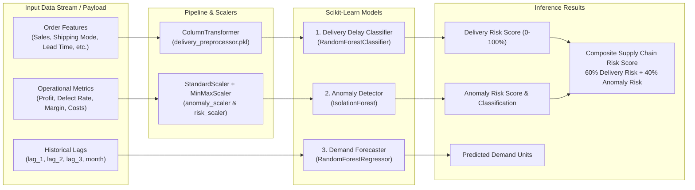
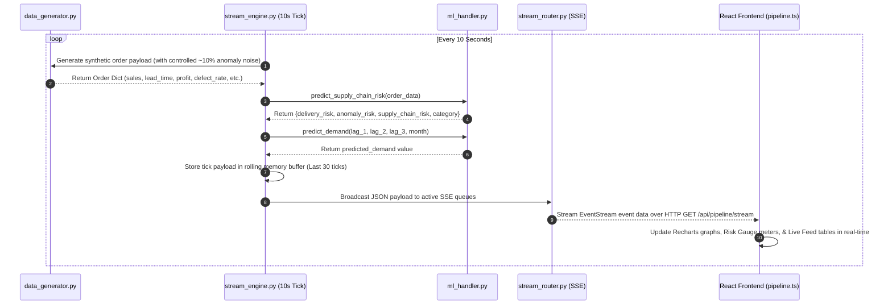

# RIMS — Real-Time Inventory & Supply Chain Intelligence System

**RIMS** (Real-Time Inventory Monitoring System) is an enterprise-grade, Databricks-backed supply chain analytics and machine learning platform. It combines live Databricks Gold-layer analytics, real-time multi-model machine learning inference (delivery risk classification, isolation forest anomaly detection, and autoregressive demand forecasting), an automated 10-second live data injection streaming pipeline via Server-Sent Events (SSE), an interactive Gradio model testing interface, and an AI-powered RAG (Retrieval-Augmented Generation) assistant.

---

## Project Vision & Core Aim

### 1. The Core Aim of RIMS
Legacy Supply Chain Management (SCM) systems rely on batch reporting (daily or weekly ETL runs), leaving logistics managers blind to intra-day disruptions. When a shipment is delayed, a supplier defect rate spikes, or inventory runs out, operations teams usually react **after** customer dissatisfaction or financial loss occurs.

**The Aim of RIMS** is to transform supply chain operations from **reactive troubleshooting** to **proactive predictive intelligence**. By pairing enterprise-scale Databricks Gold-layer analytical tables with a 10-second live machine learning inference pipeline, RIMS detects disruptions, quantifies risk, and predicts demand changes **in real time**.

### 2. What RIMS Detects
RIMS continuously monitors supply chain transactions and automatically detects:

- 🚚 **Delivery Delay Risks**: Calculates the exact probability of a shipment being delayed *before* it leaves the warehouse, based on carrier mode, market, lead time, and order priority.
- ⚠️ **Operational & Financial Anomalies**: Detects unexpected margin drops, shipping cost anomalies, order processing bottlenecks, and high supplier defect rates using unsupervised Isolation Forests.
- 📈 **Demand Shifts & Stockout Risks**: Predicts next month's product demand using autoregressive lag features ($t-1, t-2, t-3$) to prevent stockouts and overstocking.
- 🏭 **Regional & Carrier Bottlenecks**: Identifies underperforming geographic markets, carrier failure rates, and warehouse utilization metrics.

---

## Architecture Overview


---

## Machine Learning Architecture & Models Deep Dive

RIMS utilizes **three specialized scikit-learn Machine Learning models** working in tandem to provide real-time operational risk assessment, anomaly detection, and demand forecasting.



### 1. Delivery Delay Prediction Model
- **Algorithm**: `RandomForestClassifier` (Ensemble of Decision Trees) + `ColumnTransformer`.
- **Purpose**: Estimates the exact percentage probability that a given shipment order will experience a delivery delay.
- **Input Features (18 Parameters)**:
  - `product_id`, `customer_id`, `customer_segment` (Consumer, Corporate, Home Office)
  - `sales`, `quantity`, `shipping_mode` (Standard Class, First Class, Same Day, Second Class), `market` (LATAM, Europe, US, Asia Pacific)
  - `lead_time`, `avg_order_value_30d`, `num_orders_30d`, `is_high_value`, `is_bulk_order`
  - `day_of_week`, `month`, `quarter`, `year`, `department`, `class`
- **Preprocessing Pipeline**:
  - `delivery_preprocessor.pkl`: Encodes categorical variables (one-hot / ordinal) and scales numerical inputs to align with training distributions.
- **Output**: `delivery_risk` percentage ($0.0\% - 100.0\%$).

### 2. Operational Anomaly Detection Model
- **Algorithm**: `IsolationForest` + `StandardScaler` (`anomaly_scaler.pkl`) + `MinMaxScaler` (`anomaly_risk_scaler.pkl`).
- **Purpose**: Detects unusual operational patterns, fraud spikes, cost deviations, or abnormal defect rates in real-time order data.
- **Input Features (7 Operational Metrics)**:
  - `profit`, `order_processing_days`, `avg_lead_time_by_mode`
  - `avg_shipping_cost`, `avg_defect_rate`, `max_defect_rate`, `profit_margin`
- **Preprocessing & Normalization**:
  1. `StandardScaler` normalizes inputs to zero mean and unit variance ($\mu=0, \sigma=1$).
  2. `IsolationForest` computes isolation path lengths to partition feature space and calculate an anomaly decision score.
  3. `MinMaxScaler` maps the raw decision score into a standardized `anomaly_risk` score ($0.0 - 100.0$).
- **Outputs**:
  - `anomaly_prediction`: `"Normal"` vs `"Anomaly"`
  - `anomaly_score`: Raw decision function output.
  - `anomaly_risk`: Normalized risk score ($0.0\% - 100.0\%$).

### 3. Demand Forecasting Model
- **Algorithm**: `RandomForestRegressor`.
- **Purpose**: Predicts upcoming monthly product demand to prevent stockouts and overstocking.
- **Input Features (Autoregressive Lags)**:
  - `lag_1`: Total demand in the previous month ($t-1$)
  - `lag_2`: Total demand 2 months prior ($t-2$)
  - `lag_3`: Total demand 3 months prior ($t-3$)
  - `month`: Target projection month ($1 - 12$)
- **Output**: `predicted_demand` (Continuous expected unit volume).

### 4. Composite Supply Chain Risk Formula
RIMS combines **Delivery Risk** and **Anomaly Risk** into a single actionable operational metric:

$$\text{Supply Chain Risk Score} = (0.60 \times \text{Delivery Risk}) + (0.40 \times \text{Anomaly Risk})$$

#### Risk Categorization Matrix
| Risk Score Range | Category | Action Required |
|------------------|----------|-----------------|
| **$0.0 - 24.9$** | `Low` | Standard processing; optimal operations |
| **$25.0 - 59.9$** | `Medium` | Flagged for monitoring; minor lead time buffer applied |
| **$60.0 - 100.0$** | `High` | Immediate operational intervention; carrier reassignment / priority audit |

---

## Real-Time Live Data Injection & Prediction Pipeline

The **Live Data Injection Pipeline** is an automated asynchronous background engine (`live_data_injection_pipeline/`) running inside FastAPI. It simulates real-time supply chain telemetry and streams live predictions to the dashboard every 10 seconds.



### How Live Predictions Work Step-by-Step

1. **Autonomous Tick Loop (`stream_engine.py`)**:
   - An asynchronous task starts upon FastAPI initialization (`@app.on_event("startup")`).
   - Every **10 seconds**, it executes a complete inference and broadcast cycle.

2. **Synthetic Order Generation (`data_generator.py`)**:
   - Generates realistic order data covering random customer segments, shipping modes, and markets.
   - Includes controlled noise injection (~10% probability of high defect rates, long lead times, or margin drops to simulate real-world supply chain anomalies).

3. **Concurrent Model Inference (`ml_handler.py`)**:
   - **Risk & Anomaly Engine**: Invokes `predict_supply_chain_risk()` to process the order features through `delivery_preprocessor.pkl`, `delivery_delay_model.pkl`, `anomaly_scaler.pkl`, `anomaly_detection_model.pkl`, and `anomaly_risk_scaler.pkl`.
   - **Demand Engine**: Invokes `predict_demand()` using rolling demand lag windows (`lag_1`, `lag_2`, `lag_3`).

4. **Rolling Memory Buffer**:
   - Maintains a rolling queue of the **last 30 ticks** (~5 minutes of live telemetry) in memory.
   - When a new browser client connects, `GET /api/pipeline/stream` instantly sends the historical buffer first, ensuring charts are populated immediately without waiting for the next tick.

5. **Server-Sent Events (SSE) Streaming (`stream_router.py`)**:
   - Utilizes `Starlette.responses.StreamingResponse` with `media_type="text/event-stream"`.
   - Emits structured JSON events directly to connected frontend clients.

6. **Dynamic UI Rendering (`Frontend/src/services/pipeline.ts`)**:
   - React components listen to the SSE connection using standard `EventSource`.
   - Real-time risk line charts (`risk-chart.tsx`), demand forecasting charts (`forecast-chart.tsx`), and active risk breakdown cards automatically update without page refreshes.

---

## Frequently Asked Questions (Q&A)

### Q1: What is the primary aim of the RIMS project?
**Answer**: The primary aim of RIMS is to provide an end-to-end, real-time supply chain intelligence platform. It eliminates operational blind spots by bridging enterprise analytical warehousing (Databricks Gold tables) with live 10-second machine learning telemetry, enabling proactive risk mitigation before disruptions affect customers.

### Q2: What specific supply chain disruptions does RIMS detect?
**Answer**: RIMS detects three core categories of disruptions:
1. **Shipping Delays**: High probability of late delivery based on carrier, route, lead time, and order traits.
2. **Operational & Financial Anomalies**: Unusually high defect rates, unexpected shipping cost surges, and profit margin collapses.
3. **Demand Volatility**: Impending inventory stockouts or overstocking through 3-month autoregressive lag forecasting.

### Q3: Why are multiple ML models used instead of a single overall model?
**Answer**: Supply chain dynamics require different types of mathematical modeling:
- **Delivery Delay** is a *supervised classification problem* trained on historical fulfillment labels (`RandomForestClassifier`).
- **Anomaly Detection** is an *unsupervised pattern recognition problem* designed to flag novel, unseen operational failures (`IsolationForest`).
- **Demand Forecasting** is a *continuous regression problem* modeling seasonal and temporal demand trends (`RandomForestRegressor`).

### Q4: How are Delivery Risk and Anomaly Risk combined into a single score?
**Answer**: They are combined using a weighted composite formula:
$$\text{Supply Chain Risk} = 0.60 \times \text{Delivery Risk} + 0.40 \times \text{Anomaly Risk}$$
Delivery risk carries a 60% weight because fulfillment delays directly impact customer satisfaction, while operational anomalies carry a 40% weight to catch cost leaks and defect spikes.

### Q5: How does the live 10-second data injection pipeline work without overloading Databricks?
**Answer**: The live pipeline operates asynchronously in-memory inside the FastAPI backend. It generates synthetic live order telemetry and runs lightweight scikit-learn models locally every 10 seconds. Heavy analytical queries hit Databricks SQL Warehouse separately with an automated 300-second in-memory cache, keeping Databricks query costs low while maintaining instant UI reactivity.

### Q6: What is the purpose of the AI RAG Assistant?
**Answer**: The AI RAG (Retrieval-Augmented Generation) assistant enables operations teams to interact with supply chain data using natural language. It indexes operational documentation into ChromaDB and uses Google Gemini (or OpenAI) to answer complex diagnostic questions about inventory levels, risk scores, and carrier performance.

### Q7: Can developers or logistics staff test custom inputs manually?
**Answer**: Yes! An interactive Gradio GUI is embedded directly at `http://localhost:8000/model/test/`. Operations teams can manually enter custom order parameters to test edge cases, simulate anomalies, and verify risk outputs in real time.

---

## Detailed Directory & Component Structure

```
.
├── Final_App/
│   ├── start.sh                        # One-click startup script for Backend & Frontend
│   ├── stop.sh                         # Clean shutdown script for background processes
│   ├── Backend/                        # FastAPI Backend Application
│   │   ├── main.py                     # Entry point, router registration, Gradio mounting
│   │   ├── ml_handler.py               # Singleton lazy loader & runner for scikit-learn models
│   │   ├── ml_router.py                # REST endpoints for risk prediction & demand forecasting
│   │   ├── live_data_injection_pipeline/ # Real-time streaming pipeline
│   │   │   ├── __init__.py
│   │   │   ├── data_generator.py       # Realistic order & lag feature generator
│   │   │   ├── stream_engine.py        # 10s tick loop & SSE subscriber queue manager
│   │   │   └── stream_router.py        # SSE endpoint (/api/pipeline/stream) & history API
│   │   ├── databricks_client.py        # Databricks SQL connection, queries & memory caching
│   │   ├── databricks_analytics.py     # Aggregates Gold tables into dashboard data models
│   │   ├── sendData.py                 # Databricks live SSE streaming router
│   │   ├── ai_handler.py               # Multi-model LLM handler (Google Gemini + OpenAI)
│   │   ├── rag_handler.py              # Vector store document indexer & retriever (ChromaDB)
│   │   ├── requirements.txt            # Backend Python dependencies
│   │   └── .env.example                # Template for Databricks credentials & configuration
│   └── Frontend/                       # Vite + React Dashboard Application
│       ├── src/
│       │   ├── components/
│       │   │   ├── charts/
│       │   │   │   ├── forecast-chart.tsx # Demand Forecast graph with live SSE stream overlay
│       │   │   │   ├── risk-chart.tsx     # Risk Matrix bar chart & live ML risk stream timeline
│       │   │   │   └── ...
│       │   │   └── ...
│       │   ├── services/
│       │   │   ├── api.ts              # Core API fetch wrapper
│       │   │   ├── ml.ts               # REST client for ML prediction endpoints
│       │   │   ├── pipeline.ts         # SSE EventSource listener for live pipeline
│       │   │   └── ...
│       │   ├── store/                  # Zustand global state stores
│       │   └── routes/                 # React TanStack router views
│       ├── package.json
│       └── vite.config.ts
├── supply-chain-ml-models/             # Machine Learning Engine & Model Artifacts
│   ├── models/                         # Serialized scikit-learn model artifacts (.pkl)
│   │   ├── delivery_delay_model.pkl    # RandomForestClassifier for delivery delays
│   │   ├── delivery_preprocessor.pkl   # ColumnTransformer preprocessor
│   │   ├── anomaly_detection_model.pkl # IsolationForest for supply chain anomalies
│   │   ├── anomaly_scaler.pkl          # StandardScaler for numerical features
│   │   ├── anomaly_risk_scaler.pkl     # MinMaxScaler for anomaly risk normalization
│   │   ├── demand_forecasting_model.pkl# RandomForestRegressor for monthly demand
│   │   └── demand_forecast_features.pkl# Feature list definition metadata
│   ├── app.py                          # Gradio UI mounted at /model/test/ on FastAPI
│   ├── predict.py                      # Core inference routines & wrapper functions
│   ├── requirements.txt
│   └── README.md
└── DataSets/                           # Cleaned CSV datasets & Databricks SQL notebooks
```

---

## API Endpoints Reference

### Health & Pipeline Status
| Method | Endpoint | Description |
|--------|----------|-------------|
| `GET` | `/` | Health check & API version |
| `GET` | `/api/databricks-status` | Databricks connection state |
| `GET` | `/api/ml/status` | ML models load status & registered model list |
| `GET` | `/api/pipeline/status` | Live streaming pipeline execution status |

### Machine Learning & Real-Time Stream
| Method | Endpoint | Description |
|--------|----------|-------------|
| `POST` | `/api/ml/predict-risk` | Calculate delivery risk, anomaly prediction, and overall supply chain risk |
| `POST` | `/api/ml/predict-demand` | Predict monthly demand from lag inputs (`lag_1`, `lag_2`, `lag_3`, `month`) |
| `GET` | `/api/pipeline/stream` | Server-Sent Events (SSE) stream emitting ML predictions every 10s |
| `GET` | `/api/pipeline/history/risk` | Fetch recent risk prediction history (30-tick rolling buffer) |
| `GET` | `/api/pipeline/history/demand` | Fetch recent demand forecasting history |
| `GET` | `/model/test/` | Interactive Gradio UI for manual ML model testing |

### Databricks Analytics Dashboard
| Method | Endpoint | Description |
|--------|----------|-------------|
| `GET` | `/api/dashboard-summary` | KPI metrics, activity feeds, AI insights, and warehouse utilization |
| `GET` | `/api/demand-intelligence` | Demand forecast series, inventory history, and accuracy metrics |
| `GET` | `/api/regional-performance` | Regional risk matrix, risk trends, and performance totals |
| `GET` | `/api/monthly-logistics` | Monthly delivery statuses (delivered, in-transit, delayed, at-risk) |
| `GET` | `/api/inventory` | Inventory product list, stock levels, and days of cover |
| `GET` | `/api/shipments` | Latest shipment records and daily shipment volume |

---

## Getting Started

### Prerequisites
- **Python 3.10+** (Python 3.13 recommended)
- **Node.js 18+** & `npm`
- Databricks SQL Warehouse PAT (Personal Access Token)

### Environment Configuration

Create `Final_App/Backend/.env` based on `.env.example`:

```env
DATABRICKS_SERVER_HOSTNAME=adb-xxxxxxxxxxxxxxxx.x.azuredatabricks.net
DATABRICKS_HTTP_PATH=/sql/1.0/warehouses/your_warehouse_id
DATABRICKS_ACCESS_TOKEN=dapi_your_databricks_pat_here
DATABRICKS_CATALOG=main
DATABRICKS_SCHEMA=default
DATABRICKS_CACHE_TTL_SECONDS=300

# AI Assistant Keys (Optional)
GEMINI_API_KEY=your_gemini_api_key
OPENAI_API_KEY=your_openai_api_key
```

### Running the Application

To start both Backend and Frontend with a single command:

```bash
cd Final_App
bash start.sh
```

The startup script automatically:
1. Creates the Python virtual environment (`Backend/.venv`) if not present.
2. Installs required Python and Node.js dependencies.
3. Launches the FastAPI backend on `http://127.0.0.1:8000`.
4. Starts the live data injection pipeline (10s interval).
5. Verifies Databricks SQL connectivity.
6. Launches the Vite React frontend on `http://127.0.0.1:8082`.

To stop both services cleanly:

```bash
cd Final_App
bash stop.sh
```

---

## Follow-Up Questions & Next Steps

To help tailor future enhancements, consider the following technical options:

1. **ML Model Retraining Pipeline**: Would you like to implement an automated Databricks job or trigger endpoint to retrain the scikit-learn models directly on updated Gold table data periodically?
2. **Persistent Stream Storage**: Currently, the live pipeline maintains a rolling memory buffer of 30 ticks (~5 minutes). Would you like to persist these live order ticks and predictions back into a Databricks streaming table or Delta table?
3. **Alerting & Notifications**: Should we add automated Webhook/Email alerts whenever the live pipeline detects a "High" risk order or an "Anomaly" score exceeding a configured threshold?
4. **Custom Order Input Form on Dashboard**: Would you like to embed a custom interactive order submission modal directly inside the main React frontend (in addition to the Gradio interface at `/model/test`)?
5. **Deployment & Containerization**: Would you like a `docker-compose.yml` setup for containerized production deployment across backend, frontend, and pipeline components?
