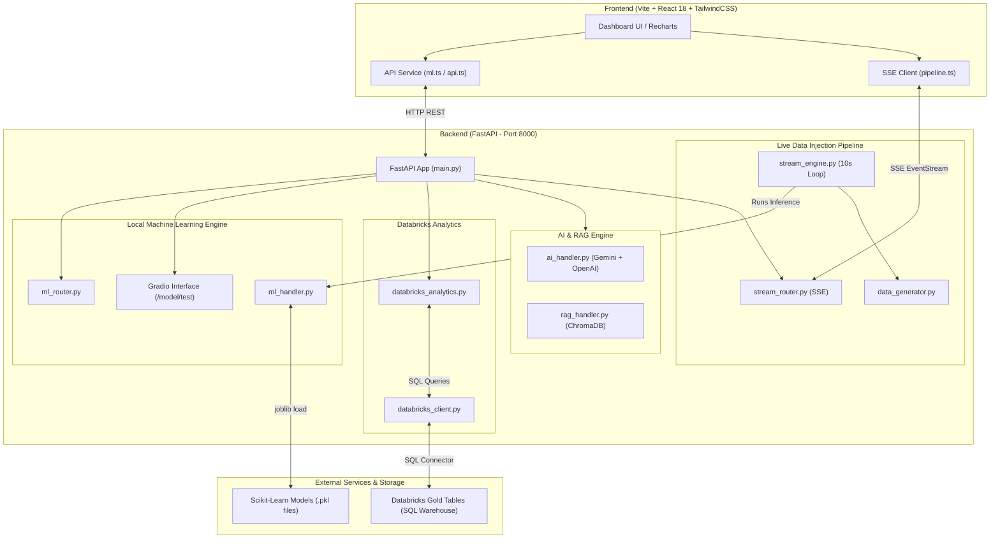

# 01 — Project Vision, Core Aim & System Architecture

## Executive Summary
**RIMS** (Real-Time Inventory Monitoring System) is an enterprise-grade supply chain analytics and machine learning platform. It combines Databricks Gold-layer analytics, real-time multi-model machine learning inference, an automated 10-second live data injection streaming pipeline via Server-Sent Events (SSE), an interactive Gradio model testing interface, and an AI-powered RAG (Retrieval-Augmented Generation) assistant.

---

## 1. Project Vision & Core Aim

### The Core Problem Solved
Legacy Supply Chain Management (SCM) systems rely on batch reporting (daily or weekly ETL runs), leaving logistics managers blind to intra-day disruptions. When a shipment is delayed, a supplier defect rate spikes, or inventory runs out, operations teams usually react **after** customer dissatisfaction or financial loss occurs.

### The Aim of RIMS
**The Aim of RIMS** is to transform supply chain operations from **reactive troubleshooting** to **proactive predictive intelligence**. By pairing enterprise-scale Databricks Gold-layer analytical tables with a 10-second live machine learning inference pipeline, RIMS detects disruptions, quantifies risk, and predicts demand changes **in real time**.

---

## 2. What RIMS Detects (Detection Matrix)

RIMS continuously monitors supply chain transactions and automatically detects:

| Detection Category | Component | Key Metrics & Indicators | Operational Impact |
|-------------------|-----------|-------------------------|-------------------|
| 🚚 **Delivery Delay Risks** | `RandomForestClassifier` | Shipping mode, carrier lead time, market, segment | Identifies high-risk orders *before* dispatch |
| ⚠️ **Operational & Financial Anomalies** | `IsolationForest` | Margin drops, shipping cost spikes, defect rates | Flags supplier defect spikes & profit leaks |
| 📈 **Demand Shifts & Stockouts** | `RandomForestRegressor` | 3-month autoregressive demand lags ($t-1, t-2, t-3$) | Prevents stockouts & warehouse overstocking |
| 🏭 **Regional & Carrier Bottlenecks** | Databricks Gold Tables | Delivery status ratios, regional performance, days of cover | Highlights underperforming carrier routes |

---

## 3. High-Level System Architecture

---

## 4. Documentation Index

- [01 Architecture and Vision](01-architecture-and-vision.md)
- [02 Machine Learning Engine](02-machine-learning-engine.md)
- [03 Live Data Injection Pipeline](03-live-data-injection-pipeline.md)
- [04 Backend and API Reference](04-backend-and-api-reference.md)
- [05 Frontend Dashboard](05-frontend-dashboard.md)
- [06 FAQ and Troubleshooting](06-faq-and-troubleshooting.md)
