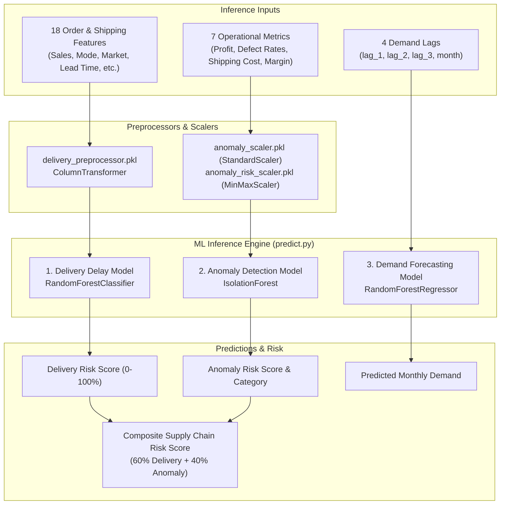

# 02 — Machine Learning Engine (`supply-chain-ml-models`)

## Overview
The Machine Learning Engine is responsible for real-time risk classification, operational anomaly detection, and demand forecasting. It consists of three production-trained scikit-learn models located in `supply-chain-ml-models/`.

---

## Architecture Diagram



---

## Detailed Model Breakdown

### 1. Delivery Delay Prediction Model
- **Artifacts**: `models/delivery_delay_model.pkl`, `models/delivery_preprocessor.pkl`
- **Algorithm**: `RandomForestClassifier` (Ensemble of Decision Trees) + `ColumnTransformer`.
- **Purpose**: Estimates the exact percentage probability that a given shipment order will experience a delivery delay.
- **Input Features (18 Parameters)**:
  - `product_id`, `customer_id`, `customer_segment` (Consumer, Corporate, Home Office)
  - `sales`, `quantity`, `shipping_mode` (Standard Class, First Class, Same Day, Second Class), `market` (LATAM, Europe, US, Asia Pacific)
  - `lead_time`, `avg_order_value_30d`, `num_orders_30d`, `is_high_value`, `is_bulk_order`
  - `day_of_week`, `month`, `quarter`, `year`, `department`, `class`
- **Preprocessing Pipeline**:
  - `delivery_preprocessor.pkl`: Encodes categorical variables (one-hot / ordinal) and scales numerical inputs.
- **Output**: `delivery_risk` percentage ($0.0\% - 100.0\%$).

### 2. Operational Anomaly Detection Model
- **Artifacts**: `models/anomaly_detection_model.pkl`, `models/anomaly_scaler.pkl`, `models/anomaly_risk_scaler.pkl`
- **Algorithm**: `IsolationForest` + `StandardScaler` + `MinMaxScaler`.
- **Purpose**: Detects unusual operational patterns, fraud spikes, cost deviations, or abnormal defect rates in real-time order data.
- **Input Features (7 Operational Metrics)**:
  - `profit`, `order_processing_days`, `avg_lead_time_by_mode`
  - `avg_shipping_cost`, `avg_defect_rate`, `max_defect_rate`, `profit_margin`
- **Preprocessing & Normalization Flow**:
  1. `StandardScaler` normalizes inputs to zero mean and unit variance ($\mu=0, \sigma=1$).
  2. `IsolationForest` computes isolation path lengths to partition feature space and calculate an anomaly decision score.
  3. `MinMaxScaler` maps the raw decision score into a standardized `anomaly_risk` score ($0.0 - 100.0$).
- **Outputs**:
  - `anomaly_prediction`: `"Normal"` vs `"Anomaly"`
  - `anomaly_score`: Raw decision function output.
  - `anomaly_risk`: Normalized risk score ($0.0\% - 100.0\%$).

### 3. Demand Forecasting Model
- **Artifacts**: `models/demand_forecasting_model.pkl`, `models/demand_forecast_features.pkl`
- **Algorithm**: `RandomForestRegressor`.
- **Purpose**: Predicts upcoming monthly product demand to prevent stockouts and overstocking.
- **Input Features (Autoregressive Lags)**:
  - `lag_1`: Total demand in the previous month ($t-1$)
  - `lag_2`: Total demand 2 months prior ($t-2$)
  - `lag_3`: Total demand 3 months prior ($t-3$)
  - `month`: Target projection month ($1 - 12$)
- **Output**: `predicted_demand` (Continuous expected unit volume).

---

## Composite Supply Chain Risk Formula

RIMS combines **Delivery Risk** and **Anomaly Risk** into a single actionable operational metric:

$$\text{Supply Chain Risk Score} = (0.60 \times \text{Delivery Risk}) + (0.40 \times \text{Anomaly Risk})$$

### Risk Categorization Matrix
| Risk Score Range | Category | Operational Recommendation |
|------------------|----------|---------------------------|
| **$0.0 - 24.9$** | `Low` | Optimal operations; standard dispatch |
| **$25.0 - 59.9$** | `Medium` | Flagged for monitoring; lead time buffer applied |
| **$60.0 - 100.0$** | `High` | Immediate intervention; priority carrier re-assignment |

---

## Programmatic Python Usage (`predict.py`)

```python
from supply_chain_ml_models.predict import predict_supply_chain_risk, predict_demand

# 1. Risk & Anomaly Inference
order_data = {
    "product_id": 365,
    "customer_id": 2,
    "customer_segment": "Consumer",
    "sales": 119.98,
    "quantity": 2,
    "shipping_mode": "Standard Class",
    "market": "LATAM",
    "lead_time": 10,
    "avg_order_value_30d": 119.98,
    "num_orders_30d": 1,
    "is_high_value": 0,
    "is_bulk_order": 0,
    "day_of_week": 3,
    "month": 1,
    "quarter": 1,
    "year": 2017,
    "department": "Technology",
    "class": "Regular Air",
    "profit": 20.0,
    "order_processing_days": 2,
    "avg_lead_time_by_mode": 10.0,
    "avg_shipping_cost": 5.0,
    "avg_defect_rate": 1.0,
    "max_defect_rate": 2.0,
    "profit_margin": 0.17
}

risk_result = predict_supply_chain_risk(order_data)
print("Risk Output:", risk_result)

# 2. Demand Forecasting Inference
demand_result = predict_demand(lag_1=4675, lag_2=4146, lag_3=4823, month=10)
print("Predicted Demand:", demand_result)
```
