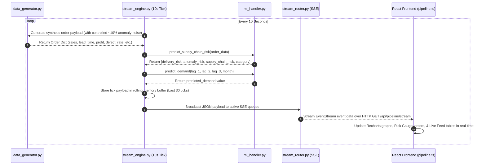

# 03 — Live Data Injection Pipeline

## Overview
The Live Data Injection Pipeline is an automated asynchronous background engine located in `Final_App/Backend/live_data_injection_pipeline/`. It simulates real-time supply chain telemetry and streams live machine learning predictions to the frontend dashboard every 10 seconds via Server-Sent Events (SSE).

---

## Streaming Sequence Diagram

---

## Detailed Component Lifecycle

### 1. Autonomous Tick Loop (`stream_engine.py`)
- Initialized asynchronously when FastAPI starts up (`@app.on_event("startup")`).
- Executes a full synthetic telemetry generation, ML inference, rolling buffer update, and SSE client broadcast every **10 seconds**.

### 2. Synthetic Order Generation (`data_generator.py`)
- Simulates realistic supply chain order transactions covering customer segments, shipping modes, and global markets.
- Features controlled noise injection (~10% probability of high defect rates, long lead times, or margin drops to simulate real-world operational anomalies).

### 3. Concurrent Model Inference (`ml_handler.py`)
- **Risk & Anomaly Engine**: Executes `predict_supply_chain_risk()` through `delivery_preprocessor.pkl`, `delivery_delay_model.pkl`, `anomaly_scaler.pkl`, `anomaly_detection_model.pkl`, and `anomaly_risk_scaler.pkl`.
- **Demand Engine**: Executes `predict_demand()` using rolling demand lag windows (`lag_1`, `lag_2`, `lag_3`).

### 4. Rolling Memory Buffer
- Maintains an in-memory rolling queue of the **last 30 ticks** (~5 minutes of live telemetry).
- When a new browser client connects, `GET /api/pipeline/stream` instantly sends the historical buffer first, ensuring charts are populated immediately without waiting for the next tick.

### 5. Server-Sent Events (SSE) Broadcast (`stream_router.py`)
- Uses `Starlette.responses.StreamingResponse` with `media_type="text/event-stream"`.
- Pushes structured JSON event chunks over persistent HTTP connections to all connected frontend clients.

### 6. Dynamic UI Rendering (`Frontend/src/services/pipeline.ts`)
- The React frontend establishes a persistent connection using standard `EventSource`.
- Real-time risk line charts (`risk-chart.tsx`), demand forecasting graphs (`forecast-chart.tsx`), and alert tables automatically re-render upon receiving new stream chunks.
