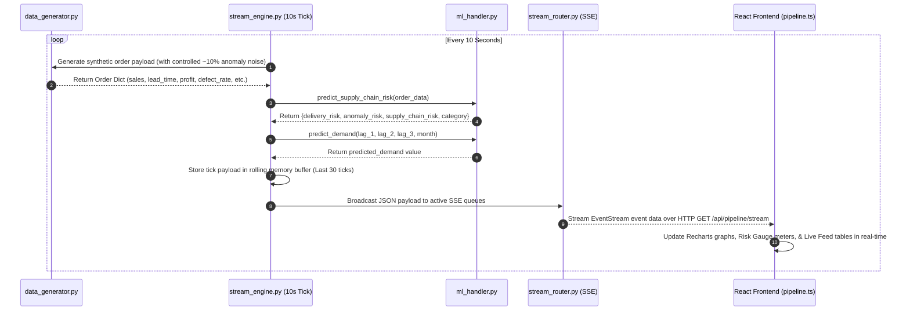

# 03 — Live Data Injection Pipeline

## Overview
The Live Data Injection Pipeline is an automated asynchronous background engine located in `Final_App/Backend/live_data_injection_pipeline/`. It simulates real-time supply chain telemetry and streams live machine learning predictions to the frontend dashboard every 10 seconds via Server-Sent Events (SSE).

---

## Streaming Sequence Diagram



---

## Data Generated by the Pipeline

The live pipeline generates **two distinct data streams** on every 10-second tick:

### 1. Order Telemetry Payload (25 Features)
Generated by `generate_order()` in `data_generator.py`, representing a live transaction ready for Risk Classification and Anomaly Detection.

| Data Category | Field Name | Data Type | Value Range / Logic | Operational Purpose |
|--------------|------------|-----------|--------------------|---------------------|
| **Customer & Segment** | `customer_segment` | String | `"Consumer"`, `"Corporate"`, `"Home Office"` | Customer profile & purchasing behavior |
| | `customer_id` | Integer | $1 - 800$ | Unique customer identifier |
| | `product_id` | Integer | $1 - 1500$ | Unique product catalog ID |
| | `market` | String | `"LATAM"`, `"Europe"`, `"USCA"`, `"Asia Pacific"`, `"Africa"` | Destination market region |
| | `department` | String | `"Technology"`, `"Furniture"`, `"Office Supplies"` | Product line category |
| | `class` | String | `"Regular Air"`, `"Delivery Truck"`, `"Express Air"` | Logistics transportation mode |
| **Financial & Volume** | `sales` | Float | $\$15.00 - \$4,500.00$ (profile-weighted) | Total order revenue |
| | `quantity` | Integer | $1 - 30$ units | Volume ordered |
| | `profit_margin` | Float | $0.02 - 0.45$ ($2\% - 45\%$) | Net profit ratio |
| | `profit` | Float | $\text{sales} \times \text{profit\_margin}$ | Total order net profit |
| | `avg_order_value_30d` | Float | $\text{sales} \pm 30\%$ jitter | Customer historical 30-day order mean |
| | `num_orders_30d` | Integer | $1 - 15$ orders | Customer 30-day order frequency |
| **Logistics & Lead Time** | `shipping_mode` | String | `"Standard Class"`, `"Second Class"`, `"First Class"`, `"Same Day"` | Selected shipping tier |
| | `lead_time` | Integer | $0 - 18$ days (mode-dependent: Same Day: 0-2d, Standard: 5-18d) | Carrier fulfillment duration |
| | `avg_lead_time_by_mode` | Float | $\text{lead\_time} \pm 20\%$ jitter | Average carrier duration baseline |
| | `avg_shipping_cost` | Float | $\$2.00 - \$60.00$ (mode-dependent) | Carrier freight charges |
| | `order_processing_days` | Integer | $1 - 6$ days | Warehouse dispatch delay |
| **Quality & Anomaly Spikes** | `avg_defect_rate` | Float | $0.3\% - 4.0\%$ (Normal), **spikes to $5.0\% - 18.0\%$ in ~10% of ticks** | Supplier quality metric (Triggers Isolation Forest Anomalies) |
| | `max_defect_rate` | Float | $1.1\times - 2.5\times$ `avg_defect_rate` | Peak batch defect rate |
| **Flags & Temporal** | `is_high_value` | Binary | $0$ or $1$ ($8\% - 30\%$ probability) | High-margin order flag |
| | `is_bulk_order` | Binary | $0$ or $1$ ($3\% - 25\%$ probability) | Large volume order flag |
| | `day_of_week`, `month`, `quarter`, `year` | Temporal | Current live timestamp variables | Seasonal & calendar context |

### 2. Autoregressive Demand Lag Data
Generated by `generate_demand_input()` in `data_generator.py` for monthly demand forecasting.

| Field Name | Data Type | Description / Generation Logic |
|------------|-----------|--------------------------------|
| `lag_1` | Integer | Unit demand from $t-1$ month (sampled from curated demand pools $\pm 8\%$ noise) |
| `lag_2` | Integer | Unit demand from $t-2$ months |
| `lag_3` | Integer | Unit demand from $t-3$ months |
| `month` | Integer | Target prediction month ($1 - 12$) |
| `rolling_mean_3` | Float | Calculated baseline average: $(\text{lag\_1} + \text{lag\_2} + \text{lag\_3}) / 3$ |

---

## Live Broadcast Event JSON Structure

Every 10 seconds, `stream_engine.py` broadcasts a combined JSON payload to connected SSE clients (`GET /api/pipeline/stream`):

```json
{
  "type": "pipeline_tick",
  "tick": "22:35:40",
  "timestamp": "2026-08-12T17:05:40.123456+00:00",
  "risk": {
    "tick": "22:35:40",
    "timestamp": "2026-08-12T17:05:40.123456+00:00",
    "order_summary": {
      "segment": "Corporate",
      "market": "LATAM",
      "sales": 1420.50,
      "quantity": 12,
      "shipping_mode": "Standard Class",
      "lead_time": 14,
      "defect_rate": 12.45
    },
    "delivery_risk": 78.50,
    "anomaly_prediction": "Anomaly",
    "anomaly_score": -0.14258,
    "anomaly_risk": 82.10,
    "supply_chain_risk": 79.94,
    "risk_category": "High"
  },
  "demand": {
    "tick": "22:35:40",
    "timestamp": "2026-08-12T17:05:40.123456+00:00",
    "lag_1": 4675,
    "lag_2": 4146,
    "lag_3": 4823,
    "month": 8,
    "predicted_demand": 4701.02,
    "rolling_mean_3": 4548.00
  }
}
```

---

## Component Lifecycle

### 1. Autonomous Tick Loop (`stream_engine.py`)
- Initialized asynchronously when FastAPI starts up (`@app.on_event("startup")`).
- Executes a full synthetic telemetry generation, ML inference, rolling buffer update, and SSE client broadcast every **10 seconds**.

### 2. Rolling Memory Buffer
- Maintains an in-memory rolling queue of the **last 30 ticks** (~5 minutes of live telemetry).
- When a new browser client connects, `GET /api/pipeline/stream` instantly sends the historical buffer first, ensuring charts are populated immediately without waiting for the next tick.

### 3. Server-Sent Events (SSE) Broadcast (`stream_router.py`)
- Uses `Starlette.responses.StreamingResponse` with `media_type="text/event-stream"`.
- Pushes structured JSON event chunks over persistent HTTP connections to all connected frontend clients.

### 4. Dynamic UI Rendering (`Frontend/src/services/pipeline.ts`)
- The React frontend establishes a persistent connection using standard `EventSource`.
- Real-time risk line charts (`risk-chart.tsx`), demand forecasting graphs (`forecast-chart.tsx`), and alert tables automatically re-render upon receiving new stream chunks.
