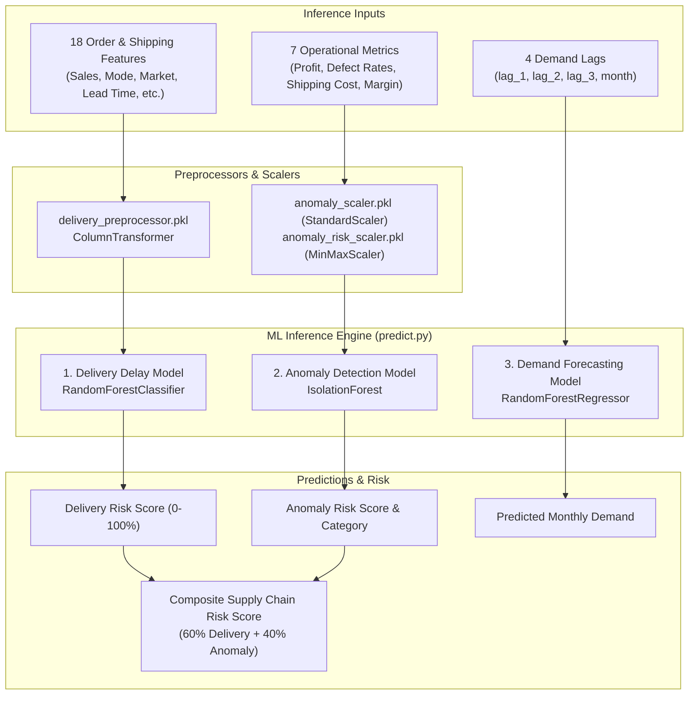

# Supply Chain Machine Learning Engine (`supply-chain-ml-models`)

Enterprise Machine Learning models for real-time supply chain risk classification, operational anomaly detection, and autoregressive demand forecasting.

---

## Machine Learning Models Architecture

This module contains three serialized, production-trained scikit-learn models:



---

## Model Specifications & Inner Workings

### 1. Delivery Delay Prediction (`RandomForestClassifier`)
- **Artifacts**: `models/delivery_delay_model.pkl`, `models/delivery_preprocessor.pkl`
- **Algorithm**: `RandomForestClassifier` with balanced class weights and decision tree bagging ensemble.
- **Preprocessing**: `ColumnTransformer` handles categorical encoding (One-Hot / Ordinal) and numerical normalization across 18 feature dimensions.
- **Output**: Late delivery probability percentage (`0.0% - 100.0%`).

### 2. Operational Anomaly Detection (`IsolationForest`)
- **Artifacts**: `models/anomaly_detection_model.pkl`, `models/anomaly_scaler.pkl`, `models/anomaly_risk_scaler.pkl`
- **Algorithm**: `IsolationForest` (Unsupervised tree isolation)
- **Mathematical Flow**:
  1. Input metrics (`profit`, `order_processing_days`, `avg_lead_time_by_mode`, `avg_shipping_cost`, `avg_defect_rate`, `max_defect_rate`, `profit_margin`) are standardized using `StandardScaler` ($\mu=0, \sigma=1$).
  2. `IsolationForest` measures tree path lengths required to isolate individual samples. Shorter path lengths signal anomalous behavior.
  3. Raw isolation scores are mapped into a standardized `0-100%` risk scale using `MinMaxScaler` (`anomaly_risk_scaler.pkl`).
- **Outputs**:
  - `anomaly_prediction`: `"Normal"` vs `"Anomaly"`
  - `anomaly_score`: Raw isolation decision output.
  - `anomaly_risk`: Normalized risk percentage (`0.0% - 100.0%`).

### 3. Demand Forecasting Engine (`RandomForestRegressor`)
- **Artifacts**: `models/demand_forecasting_model.pkl`, `models/demand_forecast_features.pkl`
- **Algorithm**: `RandomForestRegressor` (Autoregressive time-series regression)
- **Input Features**:
  - `lag_1`: Sales demand in $t-1$
  - `lag_2`: Sales demand in $t-2$
  - `lag_3`: Sales demand in $t-3$
  - `month`: Numerical target month ($1 - 12$)
- **Output**: Continuous predicted demand unit volume.

---

## Composite Supply Chain Risk Formula

Delivery Risk and Anomaly Risk are combined to generate an overall **Supply Chain Risk Score**:

$$\text{Supply Chain Risk} = (0.60 \times \text{Delivery Risk}) + (0.40 \times \text{Anomaly Risk})$$

### Risk Classification Matrix:
- **Low**: Score $< 25.0$
- **Medium**: Score $25.0 - 59.9$
- **High**: Score $\ge 60.0$

---

## Real-Time Live Streaming & In-Memory Inference

When integrated with the FastAPI backend (`Final_App/Backend`):

1. **10-Second Automated Ticks**: The streaming pipeline (`stream_engine.py`) generates order transactions every 10 seconds.
2. **In-Memory Prediction Execution**: `ml_handler.py` invokes `predict_supply_chain_risk()` and `predict_demand()` concurrently.
3. **Rolling Lag Maintenance**: Demand forecasts dynamically consume updated rolling order volumes.
4. **SSE EventStream Emission**: Live predictions are pushed to React frontend charts (`forecast-chart.tsx`, `risk-chart.tsx`) in real time.

---

## Python Usage & API

Install dependencies:

```bash
pip install -r requirements.txt
```

### 1. Risk & Anomaly Prediction

```python
from predict import predict_supply_chain_risk

order_data = {
    "product_id": 365,
    "customer_id": 2,
    "customer_segment": "Consumer",
    "sales": 119.98,
    "quantity": 2,
    "shipping_mode": "Standard Class",
    "market": "LATAM",
    "lead_time": 10,
    "avg_order_value_30d": 119.98,
    "num_orders_30d": 1,
    "is_high_value": 0,
    "is_bulk_order": 0,
    "day_of_week": 3,
    "month": 1,
    "quarter": 1,
    "year": 2017,
    "department": "Technology",
    "class": "Regular Air",
    "profit": 20.0,
    "order_processing_days": 2,
    "avg_lead_time_by_mode": 10.0,
    "avg_shipping_cost": 5.0,
    "avg_defect_rate": 1.0,
    "max_defect_rate": 2.0,
    "profit_margin": 0.17
}

result = predict_supply_chain_risk(order_data)
print(result)
```

**Example Output**:

```json
{
    "delivery_risk": 22.0,
    "anomaly_prediction": "Normal",
    "anomaly_score": 0.059487,
    "anomaly_risk": 40.06,
    "supply_chain_risk": 29.23,
    "risk_category": "Medium"
}
```

### 2. Demand Forecasting

```python
from predict import predict_demand

prediction = predict_demand(
    lag_1=4675,
    lag_2=4146,
    lag_3=4823,
    month=10
)

print("Predicted Demand:", prediction)
```

---

## Interactive Gradio Interface

A standalone interactive model testing GUI (`app.py`) is built-in and can be launched locally or mounted inside FastAPI at `http://localhost:8000/model/test/`.

To run Gradio standalone:

```bash
python app.py
```